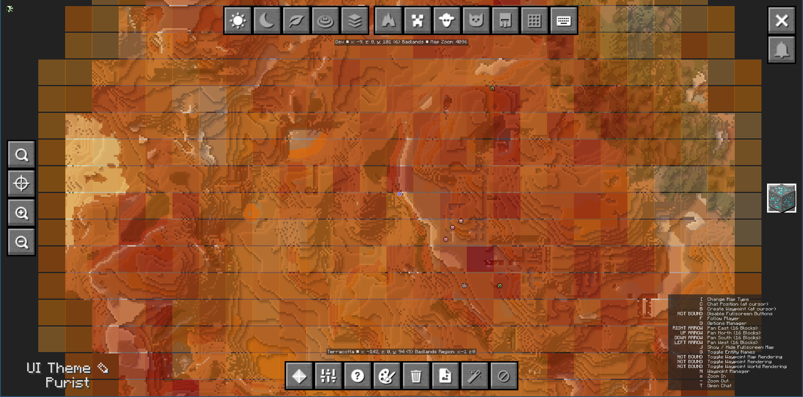

# JourneyMap Ore Heatmap

A NeoForge mod that adds ore density heatmap overlays to JourneyMap. Visualize ore concentrations across your world with color-coded chunk overlays.


## Features

- **Heatmap Visualization**: Chunks are colored based on total ore count (light yellow → orange → dark red)
- **Event-Based Scanning**: Chunks are scanned automatically when loaded - no performance impact
- **Persistent Cache**: Ore data is saved per-world and persists between sessions
- **Toggle Controls**: Enable/disable via keybind (O) or JourneyMap fullscreen button
- **Configurable**: Customize tracked ores, opacity, update interval, and more

## Requirements

- Minecraft 1.21.1
- NeoForge 21.1.x
- JourneyMap 6.0.0-beta.1 or later

## Installation

1. Install NeoForge for Minecraft 1.21.1
2. Install JourneyMap
3. Download the mod JAR from releases
4. Place the JAR in your `mods` folder

## Usage

- Press **O** to toggle the ore heatmap overlay
- Or click the grid button in JourneyMap's fullscreen map sidebar
- Chunks display colored overlays based on ore density:
  - **Light yellow**: Low ore count
  - **Orange**: Medium ore count
  - **Dark red**: High ore count

## Configuration

Configuration file: `config/journeymap_ore_heatmap-client.toml`

### General Settings

| Setting | Default | Description |
|---------|---------|-------------|
| `enabled` | `false` | Enable the ore heatmap overlay |
| `scanRadius` | `3` | Chunk scan radius around player (1-8) |
| `updateIntervalTicks` | `40` | Overlay update frequency in ticks (20 = 1 second) |
| `overlayOpacity` | `0.6` | Maximum opacity of overlays (0.1-1.0) |
| `showInCaves` | `true` | Show overlay on cave/underground maps |

### Tracked Ores

By default, the mod uses the `#c:ores` tag which automatically tracks all ores from vanilla Minecraft and most mods that follow the conventional tag system.

You can customize tracked ores in the config file using:
- **Tag format**: `#namespace:tag` (e.g., `#c:ores`)
- **Block ID format**: `namespace:block_id` (e.g., `minecraft:diamond_ore`)

Example config:
```toml
# Default - tracks all ores via conventional tag
trackedOres = ["#c:ores"]

# Or specify individual ores
trackedOres = ["minecraft:diamond_ore", "minecraft:emerald_ore"]
```

## Building from Source

```bash
# Clone the repository
git clone https://github.com/StephanMeijer/journeymap-ore-heatmap.git
cd journeymap-ore-heatmap

# Build the mod
./gradlew build

# Output JAR will be in build/libs/

# Run client for testing
./gradlew runClient
```

## Cache Location

Ore scan data is cached per-world at:
```
.minecraft/journeymap/ore_heatmap_cache/<world_id>.json
```

## License

This project is licensed under the GNU General Public License v3.0 (GPL-3.0) - see the [LICENSE](LICENSE) file for details.

## Credits

- [JourneyMap](https://journeymap.info/) for the mapping API
- [NeoForge](https://neoforged.net/) for the modding framework
